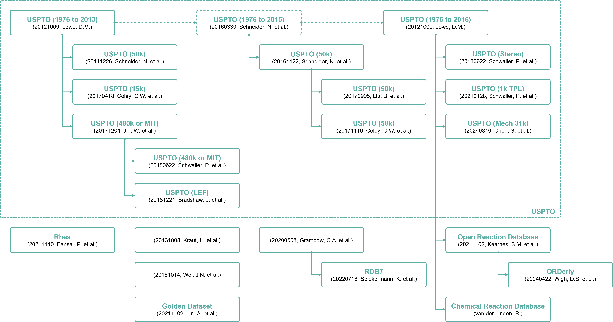

# The Data Source Project


Over the last decade, computer-assisted chemical synthesis has re-emerged as a heavily researched subject in
Chemoinformatics. Even though the idea of utilizing computers to assist chemical synthesis has existed for nearly as
long as computers themselves, the expected blend of reliability and innovation has repeatedly been proven difficult to
achieve. Nevertheless, recent machine learning approaches have exhibited the potential to address these shortcomings.
The open-source data utilized by such approaches frequently lack quality and quantity, are stored in various formats, or
are published behind paywalls, all of which can represent significant barriers, especially for novice researchers. The
main objective of the Data Source project is to systematically curate and facilitate access to relevant
computer-assisted chemical synthesis data sources.


## Installation
A standalone environment can be created using the [git](https://git-scm.com) and [conda](https://conda.io) commands as
follows:

```shell
git clone https://github.com/neo-chem-synth-wave/data-source.git

cd data-source

conda env create -f environment.yaml

conda activate data-source-env
```

The [data_source](/data_source) package can be installed using the [pip](https://pip.pypa.io) command as follows:

```shell
pip install --no-build-isolation -e .
```


## Utilization
The purpose of the [scripts](/scripts) directory is to illustrate how to download, extract, and format the following
types of computer-assisted chemical synthesis data:

- [Chemical Compounds](#chemical-compounds)
- [Chemical Reactions](#chemical-reactions)
- [Chemical Reaction Rules](#chemical-reaction-rules)

The [download_extract_and_format_data](/scripts/download_extract_and_format_data.py) script can be utilized as follows:

```shell
# Example #1: Get the chemical reaction rule data source information.
python scripts/download_extract_and_format_data.py \
  --data_source_category "reaction_rule" \
  --get_data_source_information

# Example #2: Get the ZINC20 chemical compound dataset version information.
python scripts/download_extract_and_format_data.py \
  --data_source_category "compound" \
  --data_source "zinc20" \
  --get_data_source_version_information

# Example #3: Download, extract, and format the data from the USPTO (50k) chemical reaction dataset.
python scripts/download_extract_and_format_data.py \
  --data_source_category "reaction" \
  --data_source "uspto" \
  --data_source_version "v_50k_by_20171116_coley_c_w_et_al" \
  --output_directory_path "path/to/the/output/directory"
```


### Chemical Compounds
The following chemical compound data sources are currently supported:

- [ChEMBL](#chembl)
- [ZINC20](#zinc20)
- [Miscellaneous Chemical Compound Data Sources](#miscellaneous-chemical-compound-data-sources)


#### ChEMBL
The following **ChEMBL** chemical compound database versions are currently supported:

| Version                                                                                                                                 | DOI                                        |           Status           |
|-----------------------------------------------------------------------------------------------------------------------------------------|--------------------------------------------|:--------------------------:|
| v_release_[{release_number ≥ 25}](https://chembl.gitbook.io/chembl-interface-documentation/downloads) <sup>[**[1]**](#references)</sup> | `10.6019/CHEMBL.database.{release_number}` | :green_circle: Implemented |


#### ZINC20
The following **ZINC20** chemical compound database versions are currently supported:

| Version                                                                                                                  | DOI                        |           Status           |
|--------------------------------------------------------------------------------------------------------------------------|----------------------------|:--------------------------:|
| v_building_blocks_[{building_block_subset_name}](https://files.docking.org/bb/current) <sup>[**[2]**](#references)</sup> | `10.1021/acs.jcim.0c00675` | :green_circle: Implemented |
| v_catalog_[{catalog_name}](https://files.docking.org/catalogs/source) <sup>[**[2]**](#references)</sup>                  | `10.1021/acs.jcim.0c00675` | :green_circle: Implemented |


#### Miscellaneous Chemical Compound Data Sources
The following miscellaneous chemical compound data sources are currently supported:

| Version                                                          | DOI                         |           Status           |
|------------------------------------------------------------------|-----------------------------|:--------------------------:|
| v_20190701_button_a_et_al <sup>[**[3]**](#references)</sup>      | `10.24433/CO.6930970.v1`    | :green_circle: Implemented |
| v_20201218_polykovskiy_d_et_al <sup>[**[4]**](#references)</sup> | `10.3389/fphar.2020.565644` | :green_circle: Implemented |


### Chemical Reactions
The following chemical reaction data sources are currently supported:

- [United States Patent and Trademark Office (USPTO)](#united-states-patent-and-trademark-office-uspto)
- [Open Reaction Database (ORD)](#open-reaction-database-ord)
- [Chemical Reaction Database (CRD)](#chemical-reaction-database-crd)
- [Rhea](#rhea)
- [Miscellaneous Chemical Reaction Data Sources](#miscellaneous-chemical-reaction-data-sources)




#### United States Patent and Trademark Office (USPTO)
The following **United States Patent and Trademark Office (USPTO)** chemical reaction dataset versions are currently
supported:

| Version                                                                        | DOI                               |                Status                 |
|--------------------------------------------------------------------------------|-----------------------------------|:-------------------------------------:|
| v_1976_to_2013_by_20121009_lowe_d_m <sup>[**[5]**](#references)</sup>          | `10.6084/m9.figshare.12084729.v1` | :yellow_circle: Partially Implemented |
| v_50k_by_20161122_schneider_n_et_al <sup>[**[6]**](#references)</sup>          | `10.1021/acs.jcim.6b00564`        |      :green_circle: Implemented       |
| v_15k_by_20170418_coley_c_w_et_al <sup>[**[7]**](#references)</sup>            | `10.1021/acscentsci.7b00064`      |      :green_circle: Implemented       |
| v_1976_to_2016_by_20121009_lowe_d_m <sup>[**[5]**](#references)</sup>          | `10.6084/m9.figshare.5104873.v1`  | :yellow_circle: Partially Implemented |
| v_50k_by_20171116_coley_c_w_et_al <sup>[**[8]**](#references)</sup>            | `10.1021/acscentsci.7b00355`      |      :green_circle: Implemented       |
| v_480k_or_mit_by_20171204_jin_w_et_al <sup>[**[9]**](#references)</sup>        | `10.48550/arXiv.1709.04555`       |      :green_circle: Implemented       |
| v_480k_or_mit_by_20180622_schwaller_p_et_al <sup>[[**10]**](#references)</sup> | `10.1039/C8SC02339E`              |      :green_circle: Implemented       |
| v_stereo_by_20180622_schwaller_p_et_al <sup>[**[10]**](#references)</sup>      | `10.1039/C8SC02339E`              |      :green_circle: Implemented       |
| v_1k_tpl_by_20210128_schwaller_p_et_al <sup>[**[11]**](#references)</sup>      | `10.1038/s42256-020-00284-w`      |      :green_circle: Implemented       |


#### Open Reaction Database (ORD)
The following **Open Reaction Database (ORD)** versions are currently supported:

| Version                                            | DOI                    |           Status           |
|----------------------------------------------------|------------------------|:--------------------------:|
| v_release_0_1_0 <sup>[**[12]**](#references)</sup> | `10.1021/jacs.1c09820` | :green_circle: Implemented |
| v_release_main <sup>[**[12]**](#references)</sup>  | `10.1021/jacs.1c09820` | :green_circle: Implemented |


#### Chemical Reaction Database (CRD)
The following **Chemical Reaction Database (CRD)** versions are currently supported:

| Version                                                           | DOI                               |           Status           |
|-------------------------------------------------------------------|-----------------------------------|:--------------------------:|
| v_reaction_smiles_2001_to_2021 <sup>[**[13]**](#references)</sup> | `10.6084/m9.figshare.20279733.v1` | :green_circle: Implemented |
| v_reaction_smiles_2001_to_2023 <sup>[**[13]**](#references)</sup> | `10.6084/m9.figshare.22491730.v1` | :green_circle: Implemented |
| v_reaction_smiles_2023 <sup>[**[13]**](#references)</sup>         | `10.6084/m9.figshare.24921555.v1` | :green_circle: Implemented |


#### Rhea
The following **Rhea** chemical reaction database versions are currently supported:

| Version                                                                                                                     | DOI                    |           Status           |
|-----------------------------------------------------------------------------------------------------------------------------|------------------------|:--------------------------:|
| v_release_[{release_number ≥ 126}](https://ftp.expasy.org/databases/rhea/old%5Freleases) <sup>[**[14]**](#references)</sup> | `10.1093/nar/gkab1016` | :green_circle: Implemented |


#### Miscellaneous Chemical Reaction Data Sources
The following miscellaneous chemical reaction data sources are currently supported:

| Version                                                                    | DOI                          |           Status           |
|----------------------------------------------------------------------------|------------------------------|:--------------------------:|
| v_20131008_kraut_h_et_al <sup>[**[15]**](#references)</sup>                | `10.1021/ci400442f`          | :green_circle: Implemented |
| v_20161014_wei_j_n_et_al <sup>[**[16]**](#references)</sup>                | `10.1021/acscentsci.6b00219` | :green_circle: Implemented |
| v_20200508_grambow_c_et_al_1_0_0 <sup>[**[17]**](#references)</sup>        | `10.5281/zenodo.3581267`     | :green_circle: Implemented |
| v_20200508_grambow_c_et_al_1_0_1 <sup>[**[17]**](#references)</sup>        | `10.5281/zenodo.3715478`     | :green_circle: Implemented |
| v_20200508_grambow_c_et_al_add_on_1_0_0 <sup>[**[17]**](#references)</sup> | `10.5281/zenodo.3731554`     | :green_circle: Implemented |
| v_20220718_spiekermann_k_et_al_1_0_0 <sup>[**[18]**](#references)</sup>    | `10.5281/zenodo.5652098`     | :green_circle: Implemented |
| v_20220718_spiekermann_k_et_al_1_0_1 <sup>[**[18]**](#references)</sup>    | `10.5281/zenodo.6618262`     | :green_circle: Implemented |


### Chemical Reaction Rules
The following chemical reaction rule data sources are currently supported:

- [RetroRules](#retrorules)
- [Miscellaneous Chemical Reaction Rule Data Sources](#miscellaneous-chemical-reaction-rule-data-sources)


#### RetroRules
The following **RetroRules** chemical reaction rule database versions are currently supported:

| Version                                                    | DOI                      |           Status           |
|------------------------------------------------------------|--------------------------|:--------------------------:|
| v_release_rr01_rp2_hs <sup>[**[19]**](#references)</sup>   | `10.5281/zenodo.5827427` | :green_circle: Implemented |
| v_release_rr02_rp2_hs <sup>[**[19]**](#references)</sup>   | `10.5281/zenodo.5828017` | :green_circle: Implemented |
| v_release_rr02_rp3_hs <sup>[**[19]**](#references)</sup>   | `10.5281/zenodo.5827977` | :green_circle: Implemented |
| v_release_rr02_rp3_nohs <sup>[**[19]**](#references)</sup> | `10.5281/zenodo.5827969` | :green_circle: Implemented |


#### Miscellaneous Chemical Reaction Rule Data Sources
The following miscellaneous chemical reaction rule data sources are currently supported:

| Version                                                            | DOI                      |           Status           |
|--------------------------------------------------------------------|--------------------------|:--------------------------:|
| v_20180421_avramova_s_et_al_1_0 <sup>[**[20]**](#references)</sup> | `10.5281/zenodo.1209313` | :green_circle: Implemented |
| v_20190701_button_a_et_al <sup>[**[3]**](#references)</sup>        | `10.24433/CO.6930970.v1` | :green_circle: Implemented |


## License Information
The contents of this repository are published under the [MIT](/LICENSE) license. Please refer to individual references
for more details regarding the license information of external resources utilized within this repository.


## Contact
If you are interested in contributing to this repository by reporting bugs, suggesting improvements, or submitting
feedback, feel free to use [GitHub Issues](https://github.com/neo-chem-synth-wave/data-source/issues).


## References
**[[1]](/references/20231102_zdrazil_b_et_al.md)** Zdrazil, B., Felix, E., Hunter, F., Manners, E.J., Blackshaw, J.,
Corbett, S., de Veij, M., Ioannidis, H., Lopez, D.M., Mosquera, J.F., Magarinos, M.P., Bosc, N., Arcila, R., Kizilören,
T., Gaulton, A., Bento, A.P., Adasme, M.F., Monecke, P., Landrum, G.A., and Leach, A.R. **The ChEMBL Database in 2023: A
Drug Discovery Platform Spanning Multiple Bioactivity Data Types and Time Periods**. _Nucleic Acids Research_, 52, D1,
2024, D1180-D1192.

**[[2]](/references/20201029_irwin_j_j_et_al.md)** Irwin, J.J., Tang, K.G., Young, J., Dandarchuluun, C., Wong, B.R.,
Khurelbaatar, M., Moroz, Y.S., Mayfield, J., and Sayle, R.A. **ZINC20 - A Free Ultralarge-Scale Chemical Database for
Ligand Discovery**. _J. Chem. Inf. Model._, 2020, 60, 12, 6065-6073.

**[[3]](/references/20190701_button_a_et_al.md)** Button, A., Merk, D., Hiss, J.A., and Schneider, G. **Automated De
Novo Molecular Design by Hybrid Machine Intelligence and Rule-driven Chemical Synthesis**. _Nat. Mach. Intell._, 1,
307-315, 2019.

**[[4]](/references/20201218_polykovskiy_d_et_al.md)** Polykovskiy, D., Zhebrak, A., Sanchez-Lengeling, B., Golovanov,
S., Tatanov, O., Belyaev, S., Kurbanov, R., Artamonov, A., Aladinskiy, V., Veselov, M., Kadurin, A., Johansson, S.,
Chen, H., Nikolenko, S., Aspuru-Guzik, A., and Zhavoronkov, A. **Molecular Sets (MOSES): A Benchmarking Platform for
Molecular Generation Models**. _Front. Pharmacol._, 11, 2020.

**[[5]](/references/20121009_lowe_d_m.md)** Lowe, D.M. **Extraction of Chemical Structures and Reactions from the
Literature**. _Ph.D. Thesis_, University of Cambridge, Department of Chemistry, Pembroke College, 2012.

**[[6]](/references/20161122_schneider_n_et_al.md)** Schneider, N., Stiefl, N., and Landrum, G.A. **What’s What: The
(Nearly) Definitive Guide to Reaction Role Assignment**. _J. Chem. Inf. Model._, 2016, 56, 12, 2336–2346.

**[[7]](/references/20170418_coley_c_w_et_al.md)** Coley, C.W., Barzilay, R., Jaakkola, T.S., Green, W.H., and Jensen,
K.F. **Prediction of Organic Reaction Outcomes using Machine Learning**. _ACS Cent. Sci._, 2017, 3, 5, 434–443.

**[[8]](/references/20171116_coley_c_w_et_al.md)** Coley, C.W., Rogers, L., Green, W.H., and Jensen, K.F.
**Computer-assisted Retrosynthesis Based on Molecular Similarity**. _J. Chem. Inf. Model._, 2017, 3, 12, 1237–1245.

**[[9]](/references/20171204_jin_w_et_al.md)** Jin, W., Coley, C.W., Barzilay, R., Jaakkola. T. **Predicting Organic
Reaction Outcomes with Weisfeiler-Lehman Network**. _Advances in Neural Information Processing Systems_, 30, 2017.

**[[10]](/references/20180622_schwaller_p_et_al.md)** Schwaller, P., Gaudin, T., Lányi, D., Bekas, C., and Laino, T.
**"Found in Translation": Predicting Outcomes of Complex Organic Chemistry Reactions using Neural Sequence-to-sequence
Models**. _Chem. Sci._, 2018, 9, 6091-6098.

**[[11]](/references/20210128_schwaller_p_et_al.md)** Schwaller, P., Probst, D., Vaucher, A.C., Nair, V.H., Kreutter,
D., Laino, T., Reymond, J. **Mapping the Space of Chemical Reactions using Attention-based Neural Networks**. _Nat.
Mach. Intell._, 3, 144-152, 2021.

**[[12]](/references/20211102_kearnes_s_m_et_al.md)** Kearnes, S.M., Maser, M.R., Wleklinski, M., Kast, A., Doyle, A.G.,
Dreher, S.D., Hawkins, J.M., Jensen, K.F., and Coley, C.W. **The Open Reaction Database**. _J. Am. Chem. Soc._, 2021,
143, 45, 18820–18826.

**[[13]](https://kmt.vander-lingen.nl)** **The Chemical Reaction Database (CRD)**: https://kmt.vander-lingen.nl.
Accessed on: July 26th, 2024.

**[[14]](/references/20211110_bansal_p_et_al.md)** Bansal, P., Morgat, A., Axelsen, K.B., Muthukrishnan, V., Coudert,
E., Aimo, L., Hyka-Nouspikel, N., Gasteiger, E., Kerhornou, A., Neto, T.B., Pozzato, M., Blatter, M., Ignatchenko, A.,
Redaschi, N., and Bridge, A. **Rhea, the Reaction Knowledgebase in 2022**. _Nucleic Acids Research_, 50, D1, 2022,
D693–D700.

**[[15]](/references/20131008_kraut_h_et_al.md)** Kraut, H., Eiblmaier, J., Grethe, G., Löw, P., Matuszczyk, H., and
Saller, H. **Algorithm for Reaction Classification**. _J. Chem. Inf. Model._, 2013, 53, 11, 2884–2895.

**[[16]](/references/20161014_wei_j_n_et_al.md)** Wei, J.N., Duvenaud, D., and Aspuru-Guzik, A. **Neural Networks for
the Prediction of Organic Chemistry Reactions**. _ACS Cent. Sci._, 2016, 2, 10, 725–732.

**[[17]](/references/20200508_grambow_c_a_et_al.md)** Grambow, C.A., Pattanaik, L., and Green, W.H. **Reactants,
Products, and Transition States of Elementary Chemical Reactions based on Quantum Chemistry**. _Sci. Data_, 7,
137, 2020.

**[[18]](/references/20220718_spiekermann_k_et_al.md)** Spiekermann, K., Pattanaik, L., and Green, W.H. **High Accuracy
Barrier Heights, Enthalpies, and Rate Coefficients for Chemical Reactions**. _Sci. Data_, 9, 417, 2022.

**[[19]](/references/20181013_duigou_t_et_al.md)** Duigou, T., du Lac, M., Carbonell, P., and Faulon, J. **RetroRules: A
Database of Reaction Rules for Engineering Biology**. _Nucleic Acids Research_, 47, D1, 2019, D1229–D1235.

**[[20]](/references/20180421_avramova_s_et_al.md)** Avramova, S., Kochev, N., Angelov, P. **RetroTransformDB: A Dataset
of Generic Transforms for Retrosynthetic Analysis**. _Data_, 2018, 3, 14.
