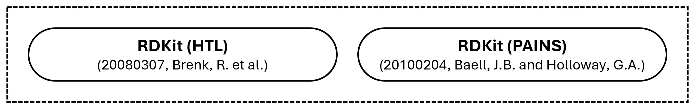

# Data Source
[](https://github.com/neo-chem-synth-wave/data-source/releases/tag/2025.5.1)
[](https://www.isct.ac.jp)
[](https://www.elix-inc.com)

Welcome to the computer-assisted chemical synthesis **data source** research project !!!

Over the past decade, computer-assisted chemical synthesis has re-emerged as a prominent research subject. Even though
the idea of utilizing computers to assist chemical synthesis has existed for nearly as long as computers themselves, the
inherent complexity repeatedly exceeded the available resources. However, recent machine learning approaches have
exhibited the potential to break this tendency. The performance of such approaches is dependent on data that frequently
suffer from limited quantity, quality, visibility, and accessibility, posing significant challenges to potential
scientific breakthroughs. Consequently, the primary objective of the **Data Source** research project is to
systematically curate and facilitate access to relevant open computer-assisted chemical synthesis data sources.


## Installation
An environment can be created using the [git](https://git-scm.com) and [conda](https://conda.io) commands as follows:

```shell
git clone https://github.com/neo-chem-synth-wave/data-source.git

cd data-source

conda env create -f environment.yaml

conda activate data-source-env
```

The [data_source](/data_source) package can be installed using the [pip](https://pip.pypa.io) command as follows:

```shell
pip install .
```


## Utilization
The purpose of the [scripts](/scripts) directory is to illustrate how to download, extract, and format the following
categories of computer-assisted chemical synthesis data:

- [Chemical Compounds](#chemical-compounds)
- [Chemical Compound Patterns](#chemical-compound-patterns)
- [Chemical Reactions](#chemical-reactions)
- [Chemical Reaction Patterns](#chemical-reaction-patterns)

The [download_extract_and_format_data](/scripts/download_extract_and_format_data.py) script can be utilized as follows:

```shell
# Get the chemical reaction data source name information.
python scripts/download_extract_and_format_data.py \
  --data_source_category "reaction" \
  --get_data_source_name_information
```

```shell
# Get the USPTO chemical reaction dataset version information.
python scripts/download_extract_and_format_data.py \
  --data_source_category "reaction" \
  --data_source_name "uspto" \
  --get_data_source_version_information
```

```shell
# Download, extract, and format the data from the USPTO chemical reaction dataset.
python scripts/download_extract_and_format_data.py \
  --data_source_category "reaction" \
  --data_source_name "uspto" \
  --data_source_version "v_50k_by_20171116_coley_c_w_et_al" \
  --output_directory_path "/path/to/the/output/directory"
```


### Chemical Compounds
The following chemical compound data sources are supported:

- [ZINC](#zinc)
- [ChEMBL](#chembl)
- [COCONUT](#coconut)
- [Miscellaneous Chemical Compound Data Sources](#miscellaneous-chemical-compound-data-sources)

The chemical compound data source relationships can be illustrated as follows:


#### ZINC
The following ZINC <sup>[[1](#references), [2](#references), [3](#references)]</sup> chemical compound database versions
are supported:

| Version                                                                                                             | DOI                        |     Status     |
|---------------------------------------------------------------------------------------------------------------------|----------------------------|:--------------:|
| v_building_block_[{building_block_subset_name}](https://files.docking.org/bb/current) <sup>[[2](#references)]</sup> | `10.1021/acs.jcim.0c00675` | :green_circle: |
| v_catalog_[{catalog_subset_name}](https://files.docking.org/catalogs/source) <sup>[[2](#references)]</sup>          | `10.1021/acs.jcim.0c00675` | :green_circle: |

<sub>:green_circle: Completely Implemented</sub>


#### ChEMBL
The following ChEMBL <sup>[[4](#references)]</sup> chemical compound database versions are supported:

| Version                                                                                                                             | DOI                                        |     Status     |
|-------------------------------------------------------------------------------------------------------------------------------------|--------------------------------------------|:--------------:|
| v_release_[{release_number ≥ 25}](https://chembl.gitbook.io/chembl-interface-documentation/downloads) <sup>[[4](#references)]</sup> | `10.6019/CHEMBL.database.{release_number}` | :green_circle: |

<sub>:green_circle: Completely Implemented</sub>


#### COCONUT
The following COCONUT <sup>[[5](#references), [6](#references)]</sup> chemical compound database versions are supported:

| Version                                                                        | DOI                       |     Status     |
|--------------------------------------------------------------------------------|---------------------------|:--------------:|
| v_2_0_by_20241126_chandrasekhar_v_et_al <sup>[[6](#references)]</sup>          | `10.5281/zenodo.13382750` | :green_circle: |
| v_2_0_complete_by_20241126_chandrasekhar_v_et_al <sup>[[6](#references)]</sup> | `10.5281/zenodo.13382750` | :green_circle: |

<sub>:green_circle: Completely Implemented</sub>


#### Miscellaneous Chemical Compound Data Sources
The following miscellaneous chemical compound data sources are supported:

| Version                                                               | DOI                         |     Status     |
|-----------------------------------------------------------------------|-----------------------------|:--------------:|
| v_moses_by_20201218_polykovskiy_d_et_al <sup>[[7](#references)]</sup> | `10.3389/fphar.2020.565644` | :green_circle: |

<sub>:green_circle: Completely Implemented</sub>


### Chemical Compound Patterns
The following chemical compound pattern data sources are supported:

- [RDKit](#rdkit)

The chemical compound pattern data source relationships can be illustrated as follows:




#### RDKit
The following RDKit <sup>[[8](#references)]</sup> chemical compound pattern dataset versions are supported:

| Version                                                                       | DOI                      |     Status     |
|-------------------------------------------------------------------------------|--------------------------|:--------------:|
| v_brenk_by_20080307_brenk_r_et_al <sup>[[9](#references)]</sup>               | `10.1002/cmdc.200700139` | :green_circle: |
| v_pains_by_20100204_baell_j_b_and_holloway_g_a <sup>[[10](#references)]</sup> | `10.1021/jm901137j`      | :green_circle: |

<sub>:green_circle: Completely Implemented</sub>


### Chemical Reactions
The following chemical reaction data sources are supported:

- [United States Patent and Trademark Office (USPTO)](#united-states-patent-and-trademark-office-uspto)
- [Open Reaction Database (ORD)](#open-reaction-database-ord)
- [Chemical Reaction Database (CRD)](#chemical-reaction-database-crd)
- [Rhea](#rhea)
- [Miscellaneous Chemical Reaction Data Sources](#miscellaneous-chemical-reaction-data-sources)

The chemical reaction data source relationships can be illustrated as follows:


#### United States Patent and Trademark Office (USPTO)
The following United States Patent and Trademark Office (USPTO) <sup>[[11](/references/2012/20121009_lowe_d_m.md)]</sup>
chemical reaction dataset versions are supported:

| Version                                                                              | DOI                               |     Status      |
|--------------------------------------------------------------------------------------|-----------------------------------|:---------------:|
| v_1976_to_2013_rsmi_by_20121009_lowe_d_m <sup>[[11](#references)]</sup>              | `10.6084/m9.figshare.12084729.v1` | :green_circle:  |
| v_50k_by_20141226_schneider_n_et_al <sup>[[12](#references)]</sup>                   | `10.1021/ci5006614`               | :green_circle:  |
| v_50k_by_20161122_schneider_n_et_al <sup>[[13](#references)]</sup>                   | `10.1021/acs.jcim.6b00564`        | :green_circle:  |
| v_15k_by_20170418_coley_c_w_et_al <sup>[[14](#references)]</sup>                     | `10.1021/acscentsci.7b00064`      | :green_circle:  |
| v_1976_to_2016_cml_by_20121009_lowe_d_m <sup>[[11](#references)]</sup>               | `10.6084/m9.figshare.5104873.v1`  | :yellow_circle: |
| v_1976_to_2016_rsmi_by_20121009_lowe_d_m <sup>[[11](#references)]</sup>              | `10.6084/m9.figshare.5104873.v1`  | :green_circle:  |
| v_50k_by_20170905_liu_b_et_al <sup>[[15](#references)]</sup>                         | `10.1021/acscentsci.7b00303`      | :green_circle:  |
| v_50k_by_20171116_coley_c_w_et_al <sup>[[16](#references)]</sup>                     | `10.1021/acscentsci.7b00355`      | :green_circle:  |
| v_480k_or_mit_by_20171204_jin_w_et_al <sup>[[17](#references)]</sup>                 | `10.48550/arXiv.1709.04555`       | :green_circle:  |
| v_480k_or_mit_by_20180622_schwaller_p_et_al <sup>[[18](#references)]</sup>           | `10.1039/C8SC02339E`              | :green_circle:  |
| v_stereo_by_20180622_schwaller_p_et_al <sup>[[18](#references)]</sup>                | `10.1039/C8SC02339E`              | :green_circle:  |
| v_lef_by_20181221_bradshaw_j_et_al <sup>[[19](#references)]</sup>                    | `10.48550/arXiv.1805.10970`       | :green_circle:  |
| v_1k_tpl_by_20210128_schwaller_p_et_al <sup>[[20](#references)]</sup>                | `10.1038/s42256-020-00284-w`      | :green_circle:  |
| v_1976_to_2016_remapped_by_20210407_schwaller_p_et_al <sup>[[21](#references)]</sup> | `10.1126/sciadv.abe4166`          | :green_circle:  |
| v_1976_to_2016_remapped_by_20240313_chen_s_et_al <sup>[[22](#references)]</sup>      | `10.6084/m9.figshare.25046471.v1` | :green_circle:  |
| v_50k_remapped_by_20240313_chen_s_et_al <sup>[[22](#references)]</sup>               | `10.6084/m9.figshare.25046471.v1` | :green_circle:  |
| v_mech_31k_by_20240810_chen_s_et_al <sup>[[23](#references)]</sup>                   | `10.6084/m9.figshare.24797220.v2` | :green_circle:  |

<sub>:green_circle: Completely Implemented</sub><br>
<sub>:yellow_circle: Partially Implemented (Limited to Reaction SMILES Strings)</sub>


#### Open Reaction Database (ORD)
The following Open Reaction Database (ORD) <sup>[[24](#references)]</sup> versions are supported:

| Version                                        | DOI                    |     Status      |
|------------------------------------------------|------------------------|:---------------:|
| v_release_0_1_0 <sup>[[24](#references)]</sup> | `10.1021/jacs.1c09820` | :yellow_circle: |
| v_release_main <sup>[[24](#references)]</sup>  | `10.1021/jacs.1c09820` | :yellow_circle: |

<sub>:green_circle: Completely Implemented</sub><br>
<sub>:yellow_circle: Partially Implemented (Limited to Reaction SMILES Strings)</sub>


#### Chemical Reaction Database (CRD)
The following Chemical Reaction Database (CRD) <sup>[[25](#references)]</sup> versions are supported:

| Version                                                       | DOI                               |     Status     |
|---------------------------------------------------------------|-----------------------------------|:--------------:|
| v_reaction_smiles_2001_to_2021 <sup>[[25](#references)]</sup> | `10.6084/m9.figshare.20279733.v1` | :green_circle: |
| v_reaction_smiles_2001_to_2023 <sup>[[25](#references)]</sup> | `10.6084/m9.figshare.22491730.v1` | :green_circle: |
| v_reaction_smiles_2023 <sup>[[25](#references)]</sup>         | `10.6084/m9.figshare.24921555.v1` | :green_circle: |
| v_reaction_smiles_1976_to_2024 <sup>[[25](#references)]</sup> | `10.6084/m9.figshare.28230053.v1` | :green_circle: |

<sub>:green_circle: Completely Implemented</sub>


#### Rhea
The following Rhea <sup>[[26](#references)]</sup> chemical reaction database versions are supported:

| Version                                                                                                                 | DOI                    |     Status     |
|-------------------------------------------------------------------------------------------------------------------------|------------------------|:--------------:|
| v_release_[{release_number ≥ 126}](https://ftp.expasy.org/databases/rhea/old%5Freleases) <sup>[[26](#references)]</sup> | `10.1093/nar/gkab1016` | :green_circle: |

<sub>:green_circle: Completely Implemented</sub>


#### Miscellaneous Chemical Reaction Data Sources
The following miscellaneous chemical reaction data sources are supported:

| Version                                                                       | DOI                               |     Status     |
|-------------------------------------------------------------------------------|-----------------------------------|:--------------:|
| v_20131008_kraut_h_et_al <sup>[[27](#references)]</sup>                       | `10.1021/ci400442f`               | :green_circle: |
| v_20161014_wei_j_n_et_al <sup>[[28](#references)]</sup>                       | `10.1021/acscentsci.6b00219`      | :green_circle: |
| v_20200508_grambow_c_et_al <sup>[[29](#references)]</sup>                     | `10.5281/zenodo.3581266`          | :green_circle: |
| v_add_on_by_20200508_grambow_c_et_al <sup>[[29](#references)]</sup>           | `10.5281/zenodo.3731553`          | :green_circle: |
| v_golden_dataset_by_20211102_lin_a_et_al <sup>[[30](#references)]</sup>       | `10.1002/minf.202100138`          | :green_circle: |
| v_rdb7_by_20220718_spiekermann_k_et_al <sup>[[31](#references)]</sup>         | `10.5281/zenodo.5652097`          | :green_circle: |
| v_orderly_condition_by_20240422_wigh_d_s_et_al <sup>[[32](#references)]</sup> | `10.6084/m9.figshare.23298467.v4` | :green_circle: |
| v_orderly_forward_by_20240422_wigh_d_s_et_al <sup>[[32](#references)]</sup>   | `10.6084/m9.figshare.23298467.v4` | :green_circle: |
| v_orderly_retro_by_20240422_wigh_d_s_et_al <sup>[[32](#references)]</sup>     | `10.6084/m9.figshare.23298467.v4` | :green_circle: |

<sub>:green_circle: Completely Implemented</sub>


### Chemical Reaction Patterns
The following chemical reaction pattern data sources are supported:

- [RetroRules](#retrorules)
- [Miscellaneous Chemical Reaction Pattern Data Sources](#miscellaneous-chemical-reaction-pattern-data-sources)

The chemical reaction pattern data source relationships can be illustrated as follows:


#### RetroRules
The following RetroRules <sup>[[33](#references)]</sup> chemical reaction pattern database versions are supported:

| Version                                                | DOI                      |     Status     |
|--------------------------------------------------------|--------------------------|:--------------:|
| v_release_rr01_rp2_hs <sup>[[33](#references)]</sup>   | `10.5281/zenodo.5827427` | :green_circle: |
| v_release_rr02_rp2_hs <sup>[[33](#references)]</sup>   | `10.5281/zenodo.5828017` | :green_circle: |
| v_release_rr02_rp3_hs <sup>[[33](#references)]</sup>   | `10.5281/zenodo.5827977` | :green_circle: |
| v_release_rr02_rp3_nohs <sup>[[33](#references)]</sup> | `10.5281/zenodo.5827969` | :green_circle: |

<sub>:green_circle: Completely Implemented</sub>


#### Miscellaneous Chemical Reaction Pattern Data Sources
The following miscellaneous chemical reaction pattern data sources are supported:

| Version                                                                          | DOI                          |     Status     |
|----------------------------------------------------------------------------------|------------------------------|:--------------:|
| v_retro_transform_db_by_20180421_avramova_s_et_al <sup>[[34](#references)]</sup> | `10.5281/zenodo.1209312`     | :green_circle: |
| v_dingos_by_20190701_button_a_et_al <sup>[[35](#references)]</sup>               | `10.24433/CO.6930970.v1`     | :green_circle: |
| v_auto_template_by_20240627_chen_l_and_li_y <sup>[[36](#references)]</sup>       | `10.1186/s13321-024-00869-2` | :green_circle: |

<sub>:green_circle: Completely Implemented</sub>


## Data
The purpose of the [data](/data) directory is to archive and backup the data sources that are hosted on
[GitHub](https://github.com), [GitLab](https://gitlab.com), and [CodeOcean](https://codeocean.com) repositories.


## License Information
The contents of this repository are published under the [MIT](/LICENSE) license. Please refer to individual references
for more details regarding the license information of external resources utilized within the repository.


## Contact
If you are interested in contributing to this repository by reporting bugs, suggesting improvements, or submitting
feedback, feel free to do so using [GitHub Issues](https://github.com/neo-chem-synth-wave/data-source/issues).


## References
**[[1](/references/2015/20151019_sterling_t_and_irwin_j_j.md)]** Sterling, T. and Irwin, J.J. **ZINC15 – Ligand
Discovery for Everyone**. _J. Chem. Inf. Model._, 2015, 55, 11, 2324-2337.

**[[2](/references/2020/20201029_irwin_j_j_et_al.md)]** Irwin, J.J., Tang, K.G., Young, J., Dandarchuluun, C., Wong,
B.R., Khurelbaatar, M., Moroz, Y.S., Mayfield, J., and Sayle, R.A. **ZINC20 - A Free Ultralarge-Scale Chemical Database
for Ligand Discovery**. _J. Chem. Inf. Model._, 2020, 60, 12, 6065-6073.

**[[3](/references/2023/20230215_tingle_b_i_et_al.md)]** Tingle, B.I., Tang, K.G., Castanon, M., Gutierrez, J.J.,
Khurelbaatar, M., Dandarchuluun, C., Moroz, Y.S., and Irwin, J.J. **ZINC22 - A Free Multi-billion-scale Database of
Tangible Compounds for Ligand Discovery**. _J. Chem. Inf. Model._, 2023, 63, 4, 1166-1176.

**[[4](/references/2023/20231102_zdrazil_b_et_al.md)]** Zdrazil, B., Felix, E., Hunter, F., Manners, E.J., Blackshaw,
J., Corbett, S., de Veij, M., Ioannidis, H., Lopez, D.M., Mosquera, J.F., Magarinos, M.P., Bosc, N., Arcila, R.,
Kizilören, T., Gaulton, A., Bento, A.P., Adasme, M.F., Monecke, P., Landrum, G.A., and Leach, A.R. **The ChEMBL Database
in 2023: A Drug Discovery Platform Spanning Multiple Bioactivity Data Types and Time Periods**. _Nucleic Acids
Research_, 52, D1, 2024, D1180-D1192.

**[[5](/references/2021/20210110_sorokina_m_et_al.md)]** Sorokina, M., Merseburger, P., Rajan, K., Yirik, M.A., and
Steinbeck, C. **COCONUT Online: Collection of Open Natural Products Database**. _J. Cheminform._, 13, 2, 2021.

**[[6](/references/2024/20241126_chandrasekhar_v_et_al.md)]** Chandrasekhar, V., Rajan, K., Kanakam, S.R.S., Sharma, N.,
Weißenborn, V., Schaub, J., and Steinbeck, C. **COCONUT 2.0: A Comprehensive Overhaul and Curation of the Collection of
Open Natural Products Database**. _Nucleic Acids Research_, 53, D1, 2025, D634–D643.

**[[7](/references/2020/20201218_polykovskiy_d_et_al.md)]** Polykovskiy, D., Zhebrak, A., Sanchez-Lengeling, B.,
Golovanov, S., Tatanov, O., Belyaev, S., Kurbanov, R., Artamonov, A., Aladinskiy, V., Veselov, M., Kadurin, A.,
Johansson, S., Chen, H., Nikolenko, S., Aspuru-Guzik, A., and Zhavoronkov, A. **Molecular Sets (MOSES): A Benchmarking
Platform for Molecular Generation Models**. _Front. Pharmacol._, 11, 2020.

**[[8](https://www.rdkit.org)]** **RDKit: Open-source Cheminformatics**: https://www.rdkit.org. Accessed on: May
1st, 2025.

**[[9](/references/2008/20080307_brenk_r_et_al.md)]** Brenk, R., Schipani, A., James, D., Krasowski, A., Gilbert, I.H.,
Frearson, J. and Wyatt, P.G. **Lessons Learnt from Assembling Screening Libraries for Drug Discovery for Neglected
Diseases**. _ChemMedChem_, 3, 435-444.

**[[10](/references/2010/20100204_baell_j_b_and_holloway_g_a.md)]** Baell, J.B. and Holloway, G.A. **New Substructure
Filters for Removal of Pan Assay Interference Compounds (PAINS) from Screening Libraries and for their Exclusion in
Bioassays**. _J. Med. Chem._, 2010, 53, 7, 2719–2740.

**[[11](/references/2012/20121009_lowe_d_m.md)]** Lowe, D.M. **Extraction of Chemical Structures and Reactions from the
Literature**. _Ph.D. Thesis_, University of Cambridge, Department of Chemistry, Pembroke College, 2012.

**[[12](/references/2014/20141226_schneider_n_et_al.md)]** Schneider, N., Lowe, D.M., Sayle, R.A., and Landrum, G.A.
**Development of a Novel Fingerprint for Chemical Reactions and Its Application to Large-scale Reaction Classification
and Similarity**. _J. Chem. Inf. Model._, 2015, 55, 1, 39–53.

**[[13](/references/2016/20161122_schneider_n_et_al.md)]** Schneider, N., Stiefl, N., and Landrum, G.A. **What’s What:
The (Nearly) Definitive Guide to Reaction Role Assignment**. _J. Chem. Inf. Model._, 2016, 56, 12, 2336–2346.

**[[14](/references/2017/20170418_coley_c_w_et_al.md)]** Coley, C.W., Barzilay, R., Jaakkola, T.S., Green, W.H., and
Jensen, K.F. **Prediction of Organic Reaction Outcomes using Machine Learning**. _ACS Cent. Sci._, 2017, 3, 5, 434–443.

**[[15](/references/2017/20170905_liu_b_et_al.md)]** Liu, B., Ramsundar, B., Kawthekar, P., Shi, J., Gomes, J., Nguyen,
Q.L., Ho, S., Sloane, J., Wender, P., and Pande, V. **Retrosynthetic Reaction Prediction Using Neural
Sequence-to-sequence Models**. _ACS Cent. Sci._, 2017, 3, 10, 1103-1113.

**[[16](/references/2017/20171116_coley_c_w_et_al.md)]** Coley, C.W., Rogers, L., Green, W.H., and Jensen, K.F.
**Computer-assisted Retrosynthesis Based on Molecular Similarity**. _J. Chem. Inf. Model._, 2017, 3, 12, 1237–1245.

**[[17](/references/2017/20171204_jin_w_et_al.md)]** Jin, W., Coley, C.W., Barzilay, R., and Jaakkola. T. **Predicting
Organic Reaction Outcomes with Weisfeiler-Lehman Network**. _Advances in Neural Information Processing Systems_,
30, 2017.

**[[18](/references/2018/20180622_schwaller_p_et_al.md)]** Schwaller, P., Gaudin, T., Lányi, D., Bekas, C., and Laino,
T. **"Found in Translation": Predicting Outcomes of Complex Organic Chemistry Reactions using Neural
Sequence-to-sequence Models**. _Chem. Sci._, 2018, 9, 6091-6098.

**[[19](/references/2018/20181221_bradshaw_j_et_al.md)]** Bradshaw, J., Kusner, M.J., Paige, B., Segler, M.H.S., and
Hernández-Lobato, M.J. **A Generative Model for Electron Paths**. _International Conference on Learning
Representations_, 2019.

**[[20](/references/2021/20210128_schwaller_p_et_al.md)]** Schwaller, P., Probst, D., Vaucher, A.C., Nair, V.H.,
Kreutter, D., Laino, T., and Reymond, J. **Mapping the Space of Chemical Reactions using Attention-based Neural
Networks**. _Nat. Mach. Intell._, 3, 144-152, 2021.

**[[21](/references/2021/20210407_schwaller_p_et_al.md)]** Schwaller, P., Hoover, B., Reymond, J., Strobelt, H., and
Laino, T. **Extraction of Organic Chemistry Grammar from Unsupervised Learning of Chemical Reactions**. _Sci. Adv._, 7,
eabe4166, 2021.

**[[22](/references/2024/20240313_chen_s_et_al.md)]** Chen, S., An, S., Babazade, R., and Jung, Y. **Precise
Atom-to-atom Mapping for Organic Reactions via Human-in-the-loop Machine Learning**.  _Nat. Commun._, 15, 2250, 2024.

**[[23](/references/2024/20240810_chen_s_et_al.md)]** Chen, S., Babazade, R., Kim, T., Han, S., and Jung, Y. **A
Large-scale Reaction Dataset of Mechanistic Pathways of Organic Reactions**. _Sci. Data_, 11, 863, 2024.

**[[24](/references/2021/20211102_kearnes_s_m_et_al.md)]** Kearnes, S.M., Maser, M.R., Wleklinski, M., Kast, A., Doyle,
A.G., Dreher, S.D., Hawkins, J.M., Jensen, K.F., and Coley, C.W. **The Open Reaction Database**. _J. Am. Chem. Soc._,
2021, 143, 45, 18820–18826.

**[[25](https://kmt.vander-lingen.nl)]** **The Chemical Reaction Database (CRD)**: https://kmt.vander-lingen.nl.
Accessed on: May 1st, 2025.

**[[26](/references/2021/20211110_bansal_p_et_al.md)]** Bansal, P., Morgat, A., Axelsen, K.B., Muthukrishnan, V.,
Coudert, E., Aimo, L., Hyka-Nouspikel, N., Gasteiger, E., Kerhornou, A., Neto, T.B., Pozzato, M., Blatter, M.,
Ignatchenko, A., Redaschi, N., and Bridge, A. **Rhea, the Reaction Knowledgebase in 2022**. _Nucleic Acids Research_,
50, D1, 2022, D693–D700.

**[[27](/references/2013/20131008_kraut_h_et_al.md)]** Kraut, H., Eiblmaier, J., Grethe, G., Löw, P., Matuszczyk, H.,
and Saller, H. **Algorithm for Reaction Classification**. _J. Chem. Inf. Model._, 2013, 53, 11, 2884–2895.

**[[28](/references/2016/20161014_wei_j_n_et_al.md)]** Wei, J.N., Duvenaud, D., and Aspuru-Guzik, A. **Neural Networks
for the Prediction of Organic Chemistry Reactions**. _ACS Cent. Sci._, 2016, 2, 10, 725–732.

**[[29](/references/2020/20200508_grambow_c_a_et_al.md)]** Grambow, C.A., Pattanaik, L., and Green, W.H. **Reactants,
Products, and Transition States of Elementary Chemical Reactions based on Quantum Chemistry**. _Sci. Data_, 7,
137, 2020.

**[[30](/references/2021/20211102_lin_a_et_al.md)]** Lin, A., Dyubankova, N., Madzhidov, T.I., Nugmanov, R.I.,
Verhoeven, J., Gimadiev, T.R., Afonina, V.A., Ibragimova, Z., Rakhimbekova, A., Sidorov, P., Gedich, A., Suleymanov, R.,
Mukhametgaleev, R., Wegner, J., Ceulemans, H., Varnek, A. **Atom-to-atom Mapping: A Benchmarking Study of Popular
Mapping Algorithms and Consensus Strategies**. _Mol. Inf._, 2022, 41, 2100138.

**[[31](/references/2022/20220718_spiekermann_k_et_al.md)]** Spiekermann, K., Pattanaik, L., and Green, W.H. **High
Accuracy Barrier Heights, Enthalpies, and Rate Coefficients for Chemical Reactions**. _Sci. Data_, 9, 417, 2022.

**[[32](/references/2024/20240422_wigh_d_s_et_al.md)]** Wigh, D.S., Arrowsmith, J., Pomberger, A., Felton, K.C., and
Lapkin, A.A. **ORDerly: Data Sets and Benchmarks for Chemical Reaction Data**. _J. Chem. Inf. Model._, 2024, 64, 9,
3790–3798.

**[[33](/references/2018/20181013_duigou_t_et_al.md)]** Duigou, T., du Lac, M., Carbonell, P., and Faulon, J.
**RetroRules: A Database of Reaction Rules for Engineering Biology**. _Nucleic Acids Research_, 47, D1, 2019,
D1229–D1235.

**[[34](/references/2018/20180421_avramova_s_et_al.md)]** Avramova, S., Kochev, N., and Angelov, P. **RetroTransformDB:
A Dataset of Generic Transforms for Retrosynthetic Analysis**. _Data_, 2018, 3, 14.

**[[35](/references/2019/20190701_button_a_et_al.md)]** Button, A., Merk, D., Hiss, J.A., and Schneider, G. **Automated
De Novo Molecular Design by Hybrid Machine Intelligence and Rule-driven Chemical Synthesis**. _Nat. Mach. Intell._, 1,
307-315, 2019.

**[[36](/references/2024/20240627_chen_l_and_li_y.md)]** Chen, L. and Li, Y. **AutoTemplate: Enhancing Chemical Reaction
Datasets for Machine Learning Applications in Organic Chemistry**. _J. Cheminform._, 16, 74, 2024.
