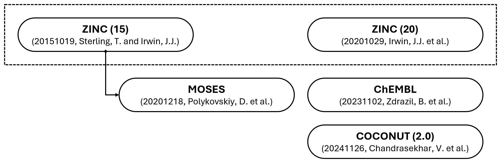
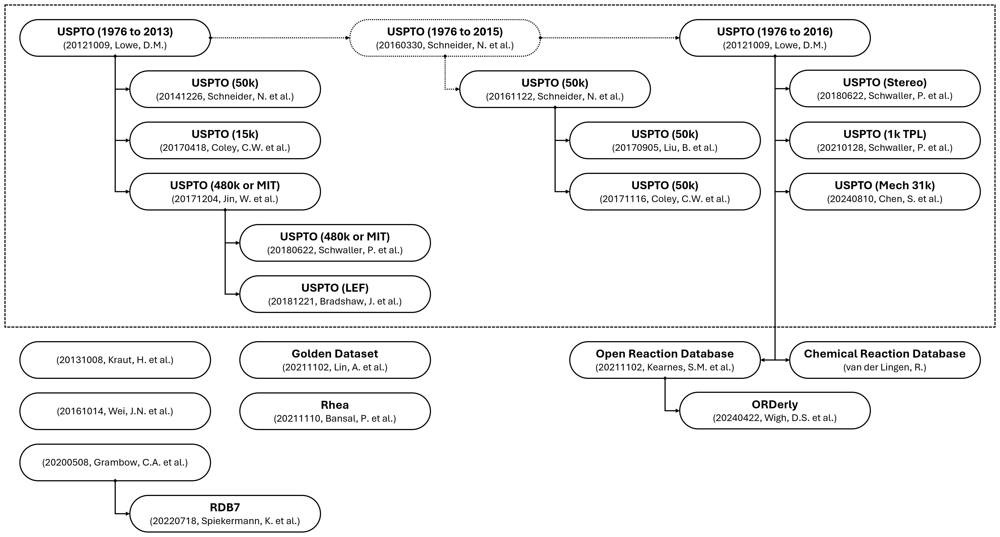

# Data Source
[](https://github.com/neo-chem-synth-wave/data-source/releases/tag/2025.9.1)
[](https://www.isct.ac.jp)
[](https://www.elix-inc.com)

Welcome to the computer-assisted chemical synthesis **data source** research project !!!

Over the past decade, computer-assisted chemical synthesis has re-emerged as a prominent research subject.
Even though the idea of utilizing computers to assist chemical synthesis has existed for nearly as long as computers themselves, the inherent complexity repeatedly exceeded the available resources.
However, recent machine learning approaches have exhibited the potential to break this tendency.
The performance of such approaches is dependent on data that frequently suffer from limited quantity, quality, visibility, and accessibility, posing significant challenges to potential scientific breakthroughs.
Consequently, the primary objective of the **Data Source** research project is to systematically curate and facilitate access to relevant open computer-assisted chemical synthesis data sources.


## Utilization Instructions
The utilization instructions of this repository are structured as follows:

- [Installation of the Package](#installation-of-the-package)
- [Utilization of the Package](#utilization-of-the-package)
- [Utilization of the Scripts](#utilization-of-the-scripts)


### Installation of the Package
The [data_source](/data_source) package can be installed in an existing environment using the [pip](https://pip.pypa.io) command as follows:

```shell
pip install data_source
```

A local environment can be created using the [git](https://git-scm.com) and [conda](https://conda.io) commands as follows:

```shell
git clone https://github.com/neo-chem-synth-wave/data-source.git

cd data-source

conda env create -f environment.yaml

conda activate data-source-env

pip install .
```


### Utilization of the Package
The [data_source](/data_source) package supports three alternatives for the downloading, extraction, and formatting of a specific version of computer-assisted chemical synthesis data from a specific source.
The first alternative is by importing and utilizing the individual data source utility classes:

```python
from data_source.compound.zinc.utility import ZINCCompoundDatabaseDownloadUtility, ZINCCompoundDatabaseExtractionUtility, ZINCCompoundDatabaseFormattingUtility

ZINCCompoundDatabaseDownloadUtility.download_v_building_block(
    version="v_building_block_bb_30",
    output_directory_path="/path/to/the/directory_a"
)

ZINCCompoundDatabaseExtractionUtility.extract_v_building_block(
    version="v_building_block_bb_30",
    input_directory_path="/path/to/the/directory_a",
    output_directory_path="/path/to/the/directory_b"
)

ZINCCompoundDatabaseFormattingUtility.format_v_building_block(
    version="v_building_block_bb_30",
    input_directory_path="/path/to/the/directory_b",
    output_directory_path="/path/to/the/directory_c"
)
```

The second alternative is by importing and utilizing the individual data source classes:

```python
from data_source.compound.zinc import ZINCCompoundDatabase

zinc_compound_db = ZINCCompoundDatabase()

zinc_compound_db.get_supported_versions()

zinc_compound_db.download(
    version="v_building_block_bb_30",
    output_directory_path="/path/to/the/directory_a"
)

zinc_compound_db.extract(
    version="v_building_block_bb_30",
    input_directory_path="/path/to/the/directory_a",
    output_directory_path="/path/to/the/directory_b"
)

zinc_compound_db.format(
    version="v_building_block_bb_30",
    input_directory_path="/path/to/the/directory_b",
    output_directory_path="/path/to/the/directory_c"
)
```

The third alternative is by importing and utilizing the data source category classes:

```python
from data_source.compound import CompoundDataSource

compound_data_source = CompoundDataSource()

compound_data_source.get_names_of_supported_data_sources()

compound_data_source.get_supported_versions(
    name="zinc"
)

compound_data_source.download(
    name="zinc",
    version="v_building_block_bb_30",
    output_directory_path="/path/to/the/directory_a"
)

compound_data_source.extract(
    name="zinc",
    version="v_building_block_bb_30",
    input_directory_path="/path/to/the/directory_a",
    output_directory_path="/path/to/the/directory_b"
)

compound_data_source.format(
    name="zinc",
    version="v_building_block_bb_30",
    input_directory_path="/path/to/the/directory_b",
    output_directory_path="/path/to/the/directory_c"
)
```


### Utilization of the Scripts
The purpose of the [scripts](/scripts) directory is to illustrate how to utilize the [data_source](/data_source) package to download, extract, and format a specific version of computer-assisted chemical synthesis data from a specific source.
The [download_extract_and_format_data](/scripts/download_extract_and_format_data.py) script can be utilized as follows:

```shell
# Get the chemical reaction data source name information.
python scripts/download_extract_and_format_data.py \
  --data_source_category "reaction" \
  --get_data_source_name_information
```

```shell
# Get the USPTO chemical reaction dataset version information.
python scripts/download_extract_and_format_data.py \
  --data_source_category "reaction" \
  --data_source_name "uspto" \
  --get_data_source_version_information
```

```shell
# Download, extract, and format the data from the USPTO chemical reaction dataset.
python scripts/download_extract_and_format_data.py \
  --data_source_category "reaction" \
  --data_source_name "uspto" \
  --data_source_version "v_50k_by_20171116_coley_c_w_et_al" \
  --output_directory_path "/path/to/the/output/directory"
```

The full list of arguments is as follows:

- `--data_source_category` or `-dsc` → The category of the data source: "compound", "compound_pattern", "reaction", or "reaction_pattern".
- `--get_data_source_name_information` or `-gdsni` → The indicator of whether to get the data source name information: True or False.
- `--data_source_name` or `-dsn` → The name of the data source: "chembl", "crd", "miscellaneous", "ord", "rdkit", "retro_rules", "rhea", "uspto", or "zinc".
- `--get_data_source_version_information` or `-gdsvi` → The indicator of whether to get the data source version information.
- `--data_source_version` or `-dsv` → The version of the data source.
- `--output_directory_path` or `-odp` → The path to the output directory where the data should be downloaded, extracted, and formatted.
- `--number_of_processes` or `-nop` → The number of processes, if relevant.


## Supported Data Sources
The following data sources are supported:

- [Chemical Compounds](#chemical-compounds)
- [Chemical Compound Patterns](#chemical-compound-patterns)
- [Chemical Reactions](#chemical-reactions)
- [Chemical Reaction Patterns](#chemical-reaction-patterns)


### Chemical Compounds
The following chemical compound data sources are supported:

- [ZINC](#zinc)
- [ChEMBL](#chembl)
- [COCONUT](#coconut)
- [Miscellaneous Chemical Compound Data Sources](#miscellaneous-chemical-compound-data-sources)

The chemical compound data source relationships can be illustrated as follows:




#### ZINC
The following ZINC <sup>[[1](#references), [2](#references), [3](#references)]</sup> chemical compound database versions
are supported:

| Version                                                                                                             | DOI                        |     Status     |
|---------------------------------------------------------------------------------------------------------------------|----------------------------|:--------------:|
| v_building_block_[{building_block_subset_name}](https://files.docking.org/bb/current) <sup>[[2](#references)]</sup> | `10.1021/acs.jcim.0c00675` | :green_circle: |
| v_catalog_[{catalog_subset_name}](https://files.docking.org/catalogs/source) <sup>[[2](#references)]</sup>          | `10.1021/acs.jcim.0c00675` | :green_circle: |

<sub>:green_circle: Completely Implemented</sub>


#### ChEMBL
The following ChEMBL <sup>[[4](#references)]</sup> chemical compound database versions are supported:

| Version                                                                                                                             | DOI                                        |     Status     |
|-------------------------------------------------------------------------------------------------------------------------------------|--------------------------------------------|:--------------:|
| v_release_[{release_number ≥ 25}](https://chembl.gitbook.io/chembl-interface-documentation/downloads) <sup>[[4](#references)]</sup> | `10.6019/CHEMBL.database.{release_number}` | :green_circle: |

<sub>:green_circle: Completely Implemented</sub>


#### COCONUT
The following COCONUT <sup>[[5](#references), [6](#references)]</sup> chemical compound database versions are supported:

| Version                                                                        | DOI                       |     Status     |
|--------------------------------------------------------------------------------|---------------------------|:--------------:|
| v_2_0_by_20241126_chandrasekhar_v_et_al <sup>[[6](#references)]</sup>          | `10.5281/zenodo.13382750` | :green_circle: |
| v_2_0_complete_by_20241126_chandrasekhar_v_et_al <sup>[[6](#references)]</sup> | `10.5281/zenodo.13382750` | :green_circle: |

<sub>:green_circle: Completely Implemented</sub>


#### Miscellaneous Chemical Compound Data Sources
The following miscellaneous chemical compound data sources are supported:

| Version                                                               | DOI                         |     Status     |
|-----------------------------------------------------------------------|-----------------------------|:--------------:|
| v_moses_by_20201218_polykovskiy_d_et_al <sup>[[7](#references)]</sup> | `10.3389/fphar.2020.565644` | :green_circle: |

<sub>:green_circle: Completely Implemented</sub>


### Chemical Compound Patterns
The following chemical compound pattern data sources are supported:

- [RDKit](#rdkit)

The chemical compound pattern data source relationships can be illustrated as follows:


#### RDKit
The following RDKit <sup>[[8](#references)]</sup> chemical compound pattern dataset versions are supported:

| Version                                                                       | DOI                      |     Status     |
|-------------------------------------------------------------------------------|--------------------------|:--------------:|
| v_htl_by_20080307_brenk_r_et_al <sup>[[9](#references)]</sup>                 | `10.1002/cmdc.200700139` | :green_circle: |
| v_pains_by_20100204_baell_j_b_and_holloway_g_a <sup>[[10](#references)]</sup> | `10.1021/jm901137j`      | :green_circle: |

<sub>:green_circle: Completely Implemented</sub>


### Chemical Reactions
The following chemical reaction data sources are supported:

- [United States Patent and Trademark Office (USPTO)](#united-states-patent-and-trademark-office-uspto)
- [Open Reaction Database (ORD)](#open-reaction-database-ord)
- [Chemical Reaction Database (CRD)](#chemical-reaction-database-crd)
- [Rhea](#rhea)
- [Miscellaneous Chemical Reaction Data Sources](#miscellaneous-chemical-reaction-data-sources)

The chemical reaction data source relationships can be illustrated as follows:




#### United States Patent and Trademark Office (USPTO)
The following United States Patent and Trademark Office (USPTO) <sup>[[11](#references)]</sup> chemical reaction dataset
versions are supported:

| Version                                                                              | DOI                               |     Status      |
|--------------------------------------------------------------------------------------|-----------------------------------|:---------------:|
| v_1976_to_2013_rsmi_by_20121009_lowe_d_m <sup>[[11](#references)]</sup>              | `10.6084/m9.figshare.12084729.v1` | :green_circle:  |
| v_50k_by_20141226_schneider_n_et_al <sup>[[12](#references)]</sup>                   | `10.1021/ci5006614`               | :green_circle:  |
| v_50k_by_20161122_schneider_n_et_al <sup>[[13](#references)]</sup>                   | `10.1021/acs.jcim.6b00564`        | :green_circle:  |
| v_15k_by_20170418_coley_c_w_et_al <sup>[[14](#references)]</sup>                     | `10.1021/acscentsci.7b00064`      | :green_circle:  |
| v_1976_to_2016_cml_by_20121009_lowe_d_m <sup>[[11](#references)]</sup>               | `10.6084/m9.figshare.5104873.v1`  | :yellow_circle: |
| v_1976_to_2016_rsmi_by_20121009_lowe_d_m <sup>[[11](#references)]</sup>              | `10.6084/m9.figshare.5104873.v1`  | :green_circle:  |
| v_50k_by_20170905_liu_b_et_al <sup>[[15](#references)]</sup>                         | `10.1021/acscentsci.7b00303`      | :green_circle:  |
| v_50k_by_20171116_coley_c_w_et_al <sup>[[16](#references)]</sup>                     | `10.1021/acscentsci.7b00355`      | :green_circle:  |
| v_480k_or_mit_by_20171204_jin_w_et_al <sup>[[17](#references)]</sup>                 | `10.48550/arXiv.1709.04555`       | :green_circle:  |
| v_480k_or_mit_by_20180622_schwaller_p_et_al <sup>[[18](#references)]</sup>           | `10.1039/C8SC02339E`              | :green_circle:  |
| v_stereo_by_20180622_schwaller_p_et_al <sup>[[18](#references)]</sup>                | `10.1039/C8SC02339E`              | :green_circle:  |
| v_lef_by_20181221_bradshaw_j_et_al <sup>[[19](#references)]</sup>                    | `10.48550/arXiv.1805.10970`       | :green_circle:  |
| v_1k_tpl_by_20210128_schwaller_p_et_al <sup>[[20](#references)]</sup>                | `10.1038/s42256-020-00284-w`      | :green_circle:  |
| v_1976_to_2016_remapped_by_20210407_schwaller_p_et_al <sup>[[21](#references)]</sup> | `10.1126/sciadv.abe4166`          | :green_circle:  |
| v_1976_to_2016_remapped_by_20240313_chen_s_et_al <sup>[[22](#references)]</sup>      | `10.6084/m9.figshare.25046471.v1` | :green_circle:  |
| v_50k_remapped_by_20240313_chen_s_et_al <sup>[[22](#references)]</sup>               | `10.6084/m9.figshare.25046471.v1` | :green_circle:  |
| v_mech_31k_by_20240810_chen_s_et_al <sup>[[23](#references)]</sup>                   | `10.6084/m9.figshare.24797220.v2` | :green_circle:  |

<sub>:green_circle: Completely Implemented</sub><br>
<sub>:yellow_circle: Partially Implemented (Limited to Reaction SMILES Strings)</sub>


#### Open Reaction Database (ORD)
The following Open Reaction Database (ORD) <sup>[[24](#references)]</sup> versions are supported:

| Version                                        | DOI                    |     Status      |
|------------------------------------------------|------------------------|:---------------:|
| v_release_0_1_0 <sup>[[24](#references)]</sup> | `10.1021/jacs.1c09820` | :yellow_circle: |
| v_release_main <sup>[[24](#references)]</sup>  | `10.1021/jacs.1c09820` | :yellow_circle: |

<sub>:green_circle: Completely Implemented</sub><br>
<sub>:yellow_circle: Partially Implemented (Limited to Reaction SMILES Strings)</sub>


#### Chemical Reaction Database (CRD)
The following Chemical Reaction Database (CRD) <sup>[[25](#references)]</sup> versions are supported:

| Version                                                       | DOI                               |     Status     |
|---------------------------------------------------------------|-----------------------------------|:--------------:|
| v_reaction_smiles_2001_to_2021 <sup>[[25](#references)]</sup> | `10.6084/m9.figshare.20279733.v1` | :green_circle: |
| v_reaction_smiles_2001_to_2023 <sup>[[25](#references)]</sup> | `10.6084/m9.figshare.22491730.v1` | :green_circle: |
| v_reaction_smiles_2023 <sup>[[25](#references)]</sup>         | `10.6084/m9.figshare.24921555.v1` | :green_circle: |
| v_reaction_smiles_1976_to_2024 <sup>[[25](#references)]</sup> | `10.6084/m9.figshare.28230053.v1` | :green_circle: |

<sub>:green_circle: Completely Implemented</sub>


#### Rhea
The following Rhea <sup>[[26](#references)]</sup> chemical reaction database versions are supported:

| Version                                                                                                                 | DOI                    |     Status     |
|-------------------------------------------------------------------------------------------------------------------------|------------------------|:--------------:|
| v_release_[{release_number ≥ 126}](https://ftp.expasy.org/databases/rhea/old%5Freleases) <sup>[[26](#references)]</sup> | `10.1093/nar/gkab1016` | :green_circle: |

<sub>:green_circle: Completely Implemented</sub>


#### Miscellaneous Chemical Reaction Data Sources
The following miscellaneous chemical reaction data sources are supported:

| Version                                                                       | DOI                               |     Status     |
|-------------------------------------------------------------------------------|-----------------------------------|:--------------:|
| v_20131008_kraut_h_et_al <sup>[[27](#references)]</sup>                       | `10.1021/ci400442f`               | :green_circle: |
| v_20161014_wei_j_n_et_al <sup>[[28](#references)]</sup>                       | `10.1021/acscentsci.6b00219`      | :green_circle: |
| v_20200508_grambow_c_et_al <sup>[[29](#references)]</sup>                     | `10.5281/zenodo.3581266`          | :green_circle: |
| v_add_on_by_20200508_grambow_c_et_al <sup>[[29](#references)]</sup>           | `10.5281/zenodo.3731553`          | :green_circle: |
| v_golden_dataset_by_20211102_lin_a_et_al <sup>[[30](#references)]</sup>       | `10.1002/minf.202100138`          | :green_circle: |
| v_rdb7_by_20220718_spiekermann_k_et_al <sup>[[31](#references)]</sup>         | `10.5281/zenodo.5652097`          | :green_circle: |
| v_orderly_condition_by_20240422_wigh_d_s_et_al <sup>[[32](#references)]</sup> | `10.6084/m9.figshare.23298467.v4` | :green_circle: |
| v_orderly_forward_by_20240422_wigh_d_s_et_al <sup>[[32](#references)]</sup>   | `10.6084/m9.figshare.23298467.v4` | :green_circle: |
| v_orderly_retro_by_20240422_wigh_d_s_et_al <sup>[[32](#references)]</sup>     | `10.6084/m9.figshare.23298467.v4` | :green_circle: |

<sub>:green_circle: Completely Implemented</sub>


### Chemical Reaction Patterns
The following chemical reaction pattern data sources are supported:

- [RetroRules](#retrorules)
- [Miscellaneous Chemical Reaction Pattern Data Sources](#miscellaneous-chemical-reaction-pattern-data-sources)

The chemical reaction pattern data source relationships can be illustrated as follows:


#### RetroRules
The following RetroRules <sup>[[33](#references)]</sup> chemical reaction pattern database versions are supported:

| Version                                                | DOI                      |     Status     |
|--------------------------------------------------------|--------------------------|:--------------:|
| v_release_rr01_rp2_hs <sup>[[33](#references)]</sup>   | `10.5281/zenodo.5827427` | :green_circle: |
| v_release_rr02_rp2_hs <sup>[[33](#references)]</sup>   | `10.5281/zenodo.5828017` | :green_circle: |
| v_release_rr02_rp3_hs <sup>[[33](#references)]</sup>   | `10.5281/zenodo.5827977` | :green_circle: |
| v_release_rr02_rp3_nohs <sup>[[33](#references)]</sup> | `10.5281/zenodo.5827969` | :green_circle: |

<sub>:green_circle: Completely Implemented</sub>


#### Miscellaneous Chemical Reaction Pattern Data Sources
The following miscellaneous chemical reaction pattern data sources are supported:

| Version                                                                          | DOI                          |     Status     |
|----------------------------------------------------------------------------------|------------------------------|:--------------:|
| v_retro_transform_db_by_20180421_avramova_s_et_al <sup>[[34](#references)]</sup> | `10.5281/zenodo.1209312`     | :green_circle: |
| v_dingos_by_20190701_button_a_et_al <sup>[[35](#references)]</sup>               | `10.24433/CO.6930970.v1`     | :green_circle: |
| v_auto_template_by_20240627_chen_l_and_li_y <sup>[[36](#references)]</sup>       | `10.1186/s13321-024-00869-2` | :green_circle: |

<sub>:green_circle: Completely Implemented</sub>


## Data
The purpose of the [data](/data) directory is to archive and backup the data sources that are hosted on [GitHub](https://github.com), [GitLab](https://gitlab.com), and [CodeOcean](https://codeocean.com) repositories.


## License Information
The contents of this repository are published under the [MIT](/LICENSE) license. Please refer to the individual references for more details regarding the license information of external resources utilized within the repository.


## Contact
If you are interested in contributing to this research project by submitting bugs, questions, and feedback or contributing to the code and data, please refer to the [contribution guidelines](CONTRIBUTING.md).


## References
**[[1](https://github.com/neo-chem-synth-wave/literature/blob/main/literature/2015/20151019_sterling_t_and_irwin_j_j.md)]** Sterling, T. and Irwin, J.J. **ZINC15 – Ligand Discovery for Everyone**. _J. Chem. Inf. Model._, 2015, 55, 11, 2324-2337.

**[[2](https://github.com/neo-chem-synth-wave/literature/blob/main/literature/2020/20201029_irwin_j_j_et_al.md)]** Irwin, J.J. et al. **ZINC20 - A Free Ultralarge-Scale Chemical Database for Ligand Discovery**. _J. Chem. Inf. Model._, 2020, 60, 12, 6065-6073.

**[[3](https://github.com/neo-chem-synth-wave/literature/blob/main/literature/2023/20230215_tingle_b_i_et_al.md)]** Tingle, B.I. et al. **ZINC22 - A Free Multi-billion-scale Database of Tangible Compounds for Ligand Discovery**. _J. Chem. Inf. Model._, 2023, 63, 4, 1166-1176.

**[[4](https://github.com/neo-chem-synth-wave/literature/blob/main/literature/2023/20231102_zdrazil_b_et_al.md)]** Zdrazil, B. et al. **The ChEMBL Database in 2023: A Drug Discovery Platform Spanning Multiple Bioactivity Data Types and Time Periods**. _Nucleic Acids Research_, 52, D1, 2024, D1180-D1192.

**[[5](https://github.com/neo-chem-synth-wave/literature/blob/main/literature/2021/20210110_sorokina_m_et_al.md)]** Sorokina, M. et al. **COCONUT Online: Collection of Open Natural Products Database**. _J. Cheminform._, 13, 2, 2021.

**[[6](https://github.com/neo-chem-synth-wave/literature/blob/main/literature/2024/20241126_chandrasekhar_v_et_al.md)]** Chandrasekhar, V. et al. **COCONUT 2.0: A Comprehensive Overhaul and Curation of the Collection of Open Natural Products Database**. _Nucleic Acids Research_, 53, D1, 2025, D634–D643.

**[[7](https://github.com/neo-chem-synth-wave/literature/blob/main/literature/2020/20201218_polykovskiy_d_et_al.md)]** Polykovskiy, D. et al. **Molecular Sets (MOSES): A Benchmarking Platform for Molecular Generation Models**. _Front. Pharmacol._, 11, 2020.

**[[8](https://www.rdkit.org)]** **RDKit: Open-source Cheminformatics**: https://www.rdkit.org. Accessed on: 2025/09/25.

**[[9](https://github.com/neo-chem-synth-wave/literature/blob/main/literature/2008/20080307_brenk_r_et_al.md)]** Brenk, R. et al. **Lessons Learnt from Assembling Screening Libraries for Drug Discovery for Neglected Diseases**. _ChemMedChem_, 3, 435-444.

**[[10](https://github.com/neo-chem-synth-wave/literature/blob/main/literature/2010/20100204_baell_j_b_and_holloway_g_a.md)]** Baell, J.B. and Holloway, G.A. **New Substructure Filters for Removal of Pan Assay Interference Compounds (PAINS) from Screening Libraries and for their Exclusion in Bioassays**. _J. Med. Chem._, 2010, 53, 7, 2719–2740.

**[[11](https://github.com/neo-chem-synth-wave/literature/blob/main/literature/2012/20121009_lowe_d_m.md)]** Lowe, D.M. **Extraction of Chemical Structures and Reactions from the Literature**. _Ph.D. Thesis_, University of Cambridge, Department of Chemistry, Pembroke College, 2012.

**[[12](https://github.com/neo-chem-synth-wave/literature/blob/main/literature/2014/20141226_schneider_n_et_al.md)]** Schneider, N. et al. **Development of a Novel Fingerprint for Chemical Reactions and Its Application to Large-scale Reaction Classification and Similarity**. _J. Chem. Inf. Model._, 2015, 55, 1, 39–53.

**[[13](https://github.com/neo-chem-synth-wave/literature/blob/main/literature/2016/20161122_schneider_n_et_al.md)]** Schneider, N. et al. **What’s What: The (Nearly) Definitive Guide to Reaction Role Assignment**. _J. Chem. Inf. Model._, 2016, 56, 12, 2336–2346.

**[[14](https://github.com/neo-chem-synth-wave/literature/blob/main/literature/2017/20170418_coley_c_w_et_al.md)]** Coley, C.W. et al. **Prediction of Organic Reaction Outcomes using Machine Learning**. _ACS Cent. Sci._, 2017, 3, 5, 434–443.

**[[15](https://github.com/neo-chem-synth-wave/literature/blob/main/literature/2017/20170905_liu_b_et_al.md)]** Liu, B. et al. **Retrosynthetic Reaction Prediction Using Neural Sequence-to-sequence Models**. _ACS Cent. Sci._, 2017, 3, 10, 1103-1113.

**[[16](https://github.com/neo-chem-synth-wave/literature/blob/main/literature/2017/20171116_coley_c_w_et_al.md)]** Coley, C.W. et al. **Computer-assisted Retrosynthesis Based on Molecular Similarity**. _J. Chem. Inf. Model._, 2017, 3, 12, 1237–1245.

**[[17](https://github.com/neo-chem-synth-wave/literature/blob/main/literature/2017/20171204_jin_w_et_al.md)]** Jin, W. et al. **Predicting Organic Reaction Outcomes with Weisfeiler-Lehman Network**. _Advances in Neural Information Processing Systems_, 30, 2017.

**[[18](https://github.com/neo-chem-synth-wave/literature/blob/main/literature/2018/20180622_schwaller_p_et_al.md)]** Schwaller, P. et al. **"Found in Translation": Predicting Outcomes of Complex Organic Chemistry Reactions using Neural Sequence-to-sequence Models**. _Chem. Sci._, 2018, 9, 6091-6098.

**[[19](https://github.com/neo-chem-synth-wave/literature/blob/main/literature/2018/20181221_bradshaw_j_et_al.md)]** Bradshaw, J. et al. **A Generative Model for Electron Paths**. _International Conference on Learning Representations_, 2019.

**[[20](https://github.com/neo-chem-synth-wave/literature/blob/main/literature/2021/20210128_schwaller_p_et_al.md)]** Schwaller, P. et al. **Mapping the Space of Chemical Reactions using Attention-based Neural Networks**. _Nat. Mach. Intell._, 3, 144-152, 2021.

**[[21](https://github.com/neo-chem-synth-wave/literature/blob/main/literature/2021/20210407_schwaller_p_et_al.md)]** Schwaller, P. et al. **Extraction of Organic Chemistry Grammar from Unsupervised Learning of Chemical Reactions**. _Sci. Adv._, 7, eabe4166, 2021.

**[[22](https://github.com/neo-chem-synth-wave/literature/blob/main/literature/2024/20240313_chen_s_et_al.md)]** Chen, S. et al. **Precise Atom-to-atom Mapping for Organic Reactions via Human-in-the-loop Machine Learning**.  _Nat. Commun._, 15, 2250, 2024.

**[[23](https://github.com/neo-chem-synth-wave/literature/blob/main/literature/2024/20240810_chen_s_et_al.md)]** Chen, S. et al. **A Large-scale Reaction Dataset of Mechanistic Pathways of Organic Reactions**. _Sci. Data_, 11, 863, 2024.

**[[24](https://github.com/neo-chem-synth-wave/literature/blob/main/literature/2021/20211102_kearnes_s_m_et_al.md)]** Kearnes, S.M. et al. **The Open Reaction Database**. _J. Am. Chem. Soc._, 2021, 143, 45, 18820–18826.

**[[25](https://kmt.vander-lingen.nl)]** **The Chemical Reaction Database (CRD)**: https://kmt.vander-lingen.nl. Accessed on: 2025/09/25.

**[[26](https://github.com/neo-chem-synth-wave/literature/blob/main/literature/2021/20211110_bansal_p_et_al.md)]** Bansal, P. et al. **Rhea, the Reaction Knowledgebase in 2022**. _Nucleic Acids Research_, 50, D1, 2022, D693–D700.

**[[27](https://github.com/neo-chem-synth-wave/literature/blob/main/literature/2013/20131008_kraut_h_et_al.md)]** Kraut, H. et al. **Algorithm for Reaction Classification**. _J. Chem. Inf. Model._, 2013, 53, 11, 2884–2895.

**[[28](https://github.com/neo-chem-synth-wave/literature/blob/main/literature/2016/20161014_wei_j_n_et_al.md)]** Wei, J.N. et al. **Neural Networks for the Prediction of Organic Chemistry Reactions**. _ACS Cent. Sci._, 2016, 2, 10, 725–732.

**[[29](https://github.com/neo-chem-synth-wave/literature/blob/main/literature/2020/20200508_grambow_c_a_et_al.md)]** Grambow, C.A. et al. **Reactants, Products, and Transition States of Elementary Chemical Reactions based on Quantum Chemistry**. _Sci. Data_, 7, 137, 2020.

**[[30](https://github.com/neo-chem-synth-wave/literature/blob/main/literature/2021/20211102_lin_a_et_al.md)]** Lin, A. et al. **Atom-to-atom Mapping: A Benchmarking Study of Popular Mapping Algorithms and Consensus Strategies**. _Mol. Inf._, 2022, 41, 2100138.

**[[31](https://github.com/neo-chem-synth-wave/literature/blob/main/literature/2022/20220718_spiekermann_k_et_al.md)]** Spiekermann, K. et al. **High Accuracy Barrier Heights, Enthalpies, and Rate Coefficients for Chemical Reactions**. _Sci. Data_, 9, 417, 2022.

**[[32](https://github.com/neo-chem-synth-wave/literature/blob/main/literature/2024/20240422_wigh_d_s_et_al.md)]** Wigh, D.S. et al. **ORDerly: Data Sets and Benchmarks for Chemical Reaction Data**. _J. Chem. Inf. Model._, 2024, 64, 9, 3790–3798.

**[[33](https://github.com/neo-chem-synth-wave/literature/blob/main/literature/2018/20181013_duigou_t_et_al.md)]** Duigou, T. et al. **RetroRules: A Database of Reaction Rules for Engineering Biology**. _Nucleic Acids Research_, 47, D1, 2019, D1229–D1235.

**[[34](https://github.com/neo-chem-synth-wave/literature/blob/main/literature/2018/20180421_avramova_s_et_al.md)]** Avramova, S. et al. **RetroTransformDB: A Dataset of Generic Transforms for Retrosynthetic Analysis**. _Data_, 2018, 3, 14.

**[[35](https://github.com/neo-chem-synth-wave/literature/blob/main/literature/2019/20190701_button_a_et_al.md)]** Button, A. et al. **Automated De Novo Molecular Design by Hybrid Machine Intelligence and Rule-driven Chemical Synthesis**. _Nat. Mach. Intell._, 1, 307-315, 2019.

**[[36](https://github.com/neo-chem-synth-wave/literature/blob/main/literature/2024/20240627_chen_l_and_li_y.md)]** Chen, L. and Li, Y. **AutoTemplate: Enhancing Chemical Reaction Datasets for Machine Learning Applications in Organic Chemistry**. _J. Cheminform._, 16, 74, 2024.
